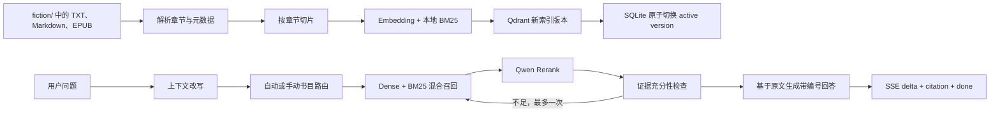

# 架构与推进路线

## 目标和边界

首版定位为可部署的单用户小说 RAG：小说只从仓库根目录 `fiction/` 读取，回答小说事实时必须依据检索到的原文，并向前端返回可定位的书名、章节和摘录。首版不做用户体系、浏览器上传、联网搜索和防剧透。

## 技术选型

| 层 | 选型 | 采用原因 | 扩展边界 |
|---|---|---|---|
| HTTP API | FastAPI + Pydantic | 异步流式接口和 OpenAPI 契约成熟 | 多实例时保持 API 无状态 |
| Agent 编排 | LangGraph | 将改写、路由、检索、证据判断做成可测试的有界流程 | 最多一次重检，避免无限循环和费用失控 |
| 元数据 | SQLite + SQLAlchemy + Alembic | 单用户零运维，迁移路径清晰 | 多用户时换 PostgreSQL |
| 向量库 | 嵌入式 Qdrant | 同时支持稠密向量、稀疏向量、过滤和 RRF | 多实例时换独立 Qdrant 服务 |
| 关键词检索 | Jieba + 本地 BM25 sparse | 中文关键词召回不依赖额外模型下载 | 可替换为专用中文分词或全文检索服务 |
| 模型 | 百炼 Qwen，兼容 OpenAI 协议 | 国内访问与中文能力合适，Chat/Embedding 可分别替换供应商 | 模型名、地址和密钥全部环境变量化 |
| 前后端流式协议 | POST + SSE | 支持请求体、渐进回答、阶段状态、引用和取消 | 如需双向实时控制再评估 WebSocket |

## 主流程

## 数据与可靠性约束

- 每个素材文件视为一本书，路径、内容哈希、解析统计和活动索引版本保存在 SQLite。
- 文件哈希未变化时跳过 Embedding；相同内容的第二个文件标记为重复。
- 新索引完整写入后才切换活动版本。重建失败时，已有旧索引继续可用。
- 删除素材并同步后，书籍标记为 `missing`，对应索引不再参与检索。
- 小说正文按不可信输入处理；正文中的命令不会进入系统指令。
- 回答只持久化实际使用的引用；模型引用不存在的编号时不会生成伪引用记录。
- 嵌入服务不可用时降级到 BM25；重排不可用时保留混合检索顺序。

## 推进阶段

### 阶段 1：后端 MVP（已完成）

- 素材解析、章节切片、增量同步、状态与重建任务。
- 混合检索、书目路由、一次重检、流式回答和原文引用。
- 对话持久化、错误协议、前端 SDK、测试、CI 和单容器部署。

### 阶段 2：前端联调（已完成）

已完成的 UI：

1. 藏书列表和 `discovered/indexing/ready/error/missing/duplicate` 状态。
2. “同步 fiction”按钮、任务进度和失败重试入口。
3. 自动识别/指定书籍的问答范围选择器。
4. SSE 阶段提示、逐字回答、停止生成和错误重试。
5. 可点击的 `[n]` 引用与书名、章节、原文摘录卡片。
6. 最近对话列表、重命名和删除。

具体请求与事件结构见 [前端联调契约](FRONTEND_INTEGRATION.md)。

### 阶段 3：RAG 质量闭环

- 建立覆盖剧情、人物、时间线、跨书比较和无答案问题的离线评测集。
- 记录召回命中率、引用正确率、无依据回答率、首字延迟和单次费用。
- 根据评测调整章节识别、切片大小、召回数量、重排模型和提示词。
- 增加“答案有帮助/引用不准确”反馈，反馈只用于评测，不直接污染知识库。

### 阶段 4：产品化与扩容

- 加入用户与知识库隔离、配额、审计和内容版权策略。
- 将 SQLite 迁移到 PostgreSQL，将嵌入式 Qdrant 迁移到独立服务。
- 将索引任务交给持久队列和独立 worker，再允许 API 多实例部署。
- 评测证明有收益后，再考虑人物关系、时间线抽取、防剧透和长篇创作辅助。

## 首版验收口径

- `fiction/` 新增、修改、删除小说后，同步结果可查询且不会重复生成未变化文件的向量。
- 对已索引小说提问可流式获得回答；事实段落带引用，引用能定位到对应章节与摘录。
- Chat、Embedding 或 Rerank 缺失/失败时返回明确错误或按设计降级。
- 后端测试、Ruff、Pyright 与前端 lint/build 在 CI 中通过。
- 小说原文、密钥、SQLite 和 Qdrant 数据不会进入公开 Git。
